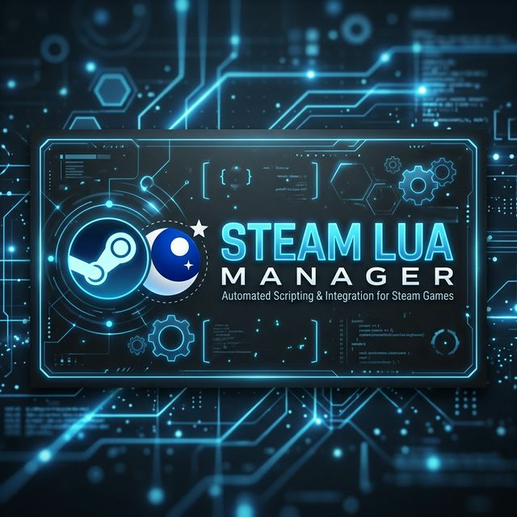

<p align="center">
  
</p>

<h1 align="center">🎮 Steam Lua Manager 🌙</h1>

<p align="center">
  <strong>Effortless Steam Management & Asset Importing</strong>
</p>

<p align="center">
  
  
  
  
</p>

---

### 🚀 Overview

**Steam Lua Manager** is a sleek, graphical utility built for power users. It simplifies the process of managing the Steam client lifecycle and automating the deployment of `.manifest` and `.lua` files into Steam's internal directories. No more manual path-hunting.

### ✨ Key Features

- ⚡ **Zero-Click Detection**: Automatically finds your Steam path using Registry keys.
- 🛠️ **Client Control**: Start, Stop, and Restart Steam directly with a single click.
- 📦 **Smart Injector**:
  - Automatically copies **.manifest** files to `depotcache`.
  - Automatically copies **.lua** scripts to `stplug-in` (under `config`).
- 🕒 **Graceful Shutdown**: Tailor the shutdown behavior with custom wait times and force-close options.
- 🖥️ **Modern UI**: Dark-themed, responsive GUI (WinForms) designed for late-night productivity.
- 📌 **Always On Top**: Keep the manager pinned for multi-tasking.

---

### 🔥 Usage Guide

#### 💠 Option 1: The Modern GUI (Recommended)
Launch the full interface to manage your Steam environment visually.
1. Right-click `steam-lua-gui.ps1`.
2. Select **Run with PowerShell**.

#### 💠 Option 2: Command Line (Fast)
Perfect for automation or quick restarts via Terminal.
```powershell
# Quick restart
.\steam-lua.ps1 -Action "Restart"

# Stop Steam gracefully
.\steam-lua.ps1 -Action "Stop"
```

---

### 📦 Installation & Setup

1. **Clone the repo**:
   ```bash
   git clone https://github.com/kozaaaaczx/steam-lua.git
   ```
2. **Execution Policy**:
   If you can't run the script, open PowerShell as Admin and run:
   ```powershell
   Set-ExecutionPolicy RemoteSigned -Scope CurrentUser
   ```

---

### 📂 Project Structure

| File | Purpose |
| :--- | :--- |
| 🖥️ `steam-lua-gui.ps1` | The main graphical application. |
| 📜 `steam-lua.ps1` | Core logic for Steam client handling. |
| 📂 `assets/` | High-quality visual assets and UI components. |
| 📝 `CHANGELOG.md` | Detailed history of updates and fixes. |

---

<p align="center">
  Made with ❤️ by <b>kozaaaaczx</b>
</p>
